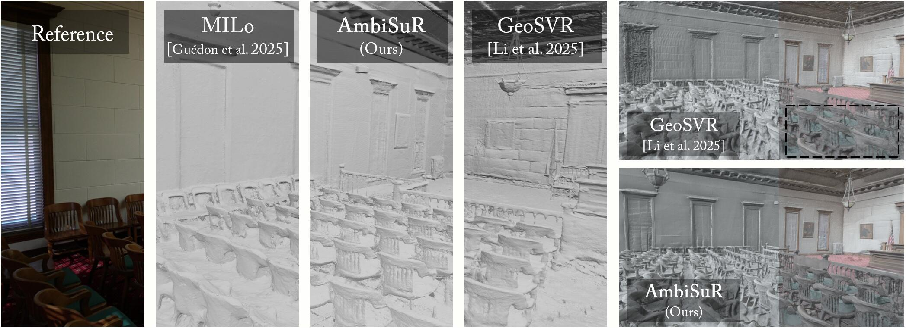

<p align="center">

<h1 align="center">Revisiting Photometric Ambiguity for Accurate Gaussian-Splatting Surface Reconstruction</h1>
  <p align="center">
    <a href="https://fictionarry.github.io/" target="_blank">Jiahe Li</a>
    ·
    <a href="https://jiaw-z.github.io/" target="_blank">Jiawei Zhang</a>
    ·
    <a href="https://scholar.google.com/citations?user=k6l1vZIAAAAJ&hl=en" target="_blank">Xiao Bai</a>
    ·
    <a href="https://openreview.net/profile?id=~Jin_Zheng1" target="_blank">Jin Zheng</a>
    ·
    <a href="https://xiaohanyu-gu.github.io/" target="_blank">Xiaohan Yu</a>
    ·
    <a href="https://sites.google.com/view/linguedu/home" target="_blank">Lin Gu</a>
    ·
    <a href="https://www.comp.nus.edu.sg/~leegh/" target="_blank">Gim Hee Lee</a>
  </p>

<h2 align="center">ICML 2026</h2>

<h4 align="center"><a href="https://arxiv.org/abs/2605.12494" target="_blank">Paper</a> | <a href="https://arxiv.org/abs/2605.12494" target="_blank">arXiv</a> | <a href="https://fictionarry.github.io/AmbiSuR-Proj/" target="_blank">Project Page</a>  </h4>
  <div align="center"></div>
</p>

<p align="center">
  <a href="">
    
  </a>
</p>

<p align="center">
In CHALLENGING scenarios with ambiguous photometric constraints, previous methods lose the capability to identify the correct surfaces even under priors, leading to a noticeable performance drop with erroneous reconstructions. Instead, AmbiSuR stands out by delivering accurate geometry with delicate details.</p>
<br>


## Installation

1. Install and activate the basic environment by `conda env create -f environment.yml` following the reference configuration. PyTorch >= 2.0 is required for Depth Anything 3. 
2. `pip install -r torch_depended_env.txt` for the PyTorch-related and customized CUDA components. 
3. Install Depth Anything 3 by `pip install git+https://github.com/ByteDance-Seed/depth-anything-3.git` for the default multi-view depth priors. (Optional)

## Reconstructing Capture

Below go through the workflow for reconstruction from a scene capturing.

### Data Preparation

Principlely, this project is compatible with COLMAP format datasets. We recommend following [Gaussian Splatting](https://github.com/graphdeco-inria/gaussian-splatting?tab=readme-ov-file#processing-your-own-scenes) to handle the images captures.

### Priors Calculation
Run `bash scripts/run_da3.sh <dataset_dir> <max_points> <ransac_thresh>` to preprocess the Depth Anything 3 priors aligned to the COLMAP data. 
- If successfully, `sparse_da3_aligned/`should be generated in the scene dir. 
- Chunk size of 450 is adopted for single 48GB GPU. The value can be set in `./multi_view_priors/estimate_colmap.py` if for other devices.
- (This step can be skipped if other kinds of priors are expected.)
> After this, point clouds from DA3 are priorized for initialization. Adjust the code if other strategies are required. 

### Scene Optimization

```bash
python train.py --source_path $DATA_PATH --model_path $OUTPUT_PATH
```

```bash
python mesh_extract/extract_adaptive.py --model_path $OUTPUT_PATH
```

All the results will be saved into the specified `$OUTPUT_PATH` including the following results:

- `mesh/`: Output mesh `tsdf_fusion_post.ply` and the evaluations.
- `pg_view/`: Visualization of the training progress. Useful for debugging.
- `train/`: Rendered mesh and visualizations from the training set.

The configuration is defined by command param and flags.
Here we list some important hyperparameters for optimization:

- Photometric Disambiguation
  - `--trunc_sigma 2.0` to specify the threshold of Gaussian Primitive Truncation. Larger denotes less truncated. 
  - `--ray_color_lambda 1e-5` to specify the weight of Ray-Color Consistency regularization.
- Priors and SH Ambiguity Indicator
  - `--depth_weight 0.1` to weight the basic depth regularization term. Corresponds to the $\tau\mathcal{L}_{geo}$ in the paper.
  - `--sh_ambi_upper_ratio 0.95` and `--sh_ambi_upper_ratio 0.1` denote the normalized percentile to select the two primitive sets for Dual-End Indication. 
  - `--use_mono` to enable the using of Depth Anything 2 monocular depth to alternate the default Depth Anything 3 metric depth. Corresponds to the AmbiSuR-Mono variant in the paper.


### Extracting Mesh

```bash
python mesh_extract/extract_<type>.py $OUTPUT_PATH
```
- `--voxel_size 0.002` to determine the resolution of the mesh. Note that a smaller voxel size requires more costs in RAM and storage.
- `--sdf_trunc_scale 4.0` to control the truncated TSDF multiplier based on voxel size. Increase if the mesh is unideally incomplete and decrease when inaccurate vertices remain.
- `--max_depth 5.0` to set the extraction bound of the scene. An example is in `mesh_extract/extract_adaptive.py` to adaptively estimate the bound according to the training cameras.

### Rendering Views

- Rendering test views (if exist) with visualizations:
  - `python extract_general.py --model_path $OUTPUT_PATH --skip_train`
- Rendering reconstructed mesh at training views with open3d:
  - `python render_mesh.py $OUTPUT_PATH`
  - It only works after the mesh file has been extracted. 

## Evaluations on Public Dataset

We provide experiment scripts and configurations in `scripts/` to reproduce the experiments. 

### Download Datasets

We use the preprocessed DTU dataset from [2DGS](https://github.com/hbb1/2d-gaussian-splatting?tab=readme-ov-file#quick-examples), the official Tanks and Temples dataset, and the official Mip-NeRF 360 dataset. Here are the instructions for each.

- [DTU](https://drive.google.com/file/d/1ODiOu72tAGPTnhVn0cFZ9MvymDgcoHxQ/view?usp=drive_link) dataset (2DGS pre-processed)
  - To get the ground-truths, you need also to download the [Points.zip](http://roboimagedata2.compute.dtu.dk/data/MVS/Points.zip) and [SampleSet.zip](http://roboimagedata2.compute.dtu.dk/data/MVS/SampleSet.zip).
  - Run `bash scripts/run_da3.sh ./data/DTU_2dgs 50000 0.01` for DA3 priors.
- [Tanks and Temples](https://www.tanksandtemples.org/download/) dataset (Official)
  - Ground truth, image set, camera poses, alignment, and cropfiles are required.
  - Due to substantial inaccurate estimation existing, we recommend using the 2DGS pre-processed `Courthouse` folder from [here](https://huggingface.co/datasets/ZehaoYu/gaussian-opacity-fields/tree/main) to replace the official data.
  - Run `python scripts/preprocess/convert_tnt.py --tnt_path <TnT_path>` to process the scenes with COLMAP.
  - Run `bash scripts/run_da3.sh ./data/TnT 500000 0.05` for DA3 priors.
- [Mip-NeRF 360](https://jonbarron.info/mipnerf360/) dataset (Official)

The default dataset organizations under `data/` are like this:

```
TnT
├─ Barn
│  ├─ Barn_COLMAP_SfM.log   (camera poses)
│  ├─ Barn.json             (cropfiles)
│  ├─ Barn.ply              (ground-truth point cloud)
│  ├─ Barn_trans.txt        (colmap-to-ground-truth transformation)
│  ├─ database.db           (colmap generated database)
│  ├─ transforms.json       (generated)
│  ├─ sparse/               (formatted cameras)
│  ├─ images/               (processed images)
│  └─ images_raw            (raw input images downloaded from Tanks and Temples website)
│     ├─ 000001.png
│     ...
...
DTU_eval                         (official ground truth)
├─ ObsMask/                 (observisibility masks)
└─ Points/                  (stl point clouds)
DTU_2dgs                    (2DGS pre-processed training set)
├─ scan24/
...
360_v2                      (Official Mip-NeRF 360 dataset)
├─ bicycle/
...
```

### Run Evaluation

Following the below examples to reproduce the evaluation on the datasets.

```bash
# Run training on the datasets
python scripts/run_dtu.py output/dtu
python scripts/run_tnt.py output/tnt
python scripts/run_mip360.py output/mip360

# Summarize results
python scripts/stat/stat_dtu.py output/dtu
python scripts/stat/stat_tnt.py output/tnt
python scripts/stat/stat_360.py output/mip360
```
- The reproduced mesh results are provided on [Hugging Face](https://huggingface.co/Fictionary/AmbiSuR).

**Note:** The evaluation scripts have a non-trivial influence on mesh quality measurement. In our project, we use the original [Tanks and Temples toolbox](https://github.com/isl-org/TanksAndTemples/tree/master/python_toolbox/evaluation) tranferred to updated Open3D, and [DTU evaluation script](https://github.com/hbb1/2d-gaussian-splatting/tree/main/scripts/eval_dtu) based on [DTUeval-python](https://github.com/jzhangbs/DTUeval-python). 

Besides, there are also some available customized TnT evaluation scripts used in SVRaster, 2DGS, GOF and so on, which have different implementations. These may produce slightly higher results than the previous one. 

## Acknowledgement


This method is mainly developed on the open-source projects [gaussian-splatting](https://github.com/graphdeco-inria/gaussian-splatting), [Depth-Anything-3](https://github.com/ByteDance-Seed/depth-anything-3), and [PGSR](https://github.com/zju3dv/PGSR). Partial scripts are borrowed from [VGGT](https://github.com/facebookresearch/vggt) and [SVRaster](https://github.com/NVlabs/svraster). Thanks for their great contributions.


------

Please kindly consider citing as below if you find this repository helpful in your project:

```bibTeX
@inproceedings{li2026ambisur,
  title={Revisiting Photometric Ambiguity for Accurate Gaussian-Splatting Surface Reconstruction},
  author={Li, Jiahe and Zhang, Jiawei and Bai, Xiao and Zheng, Jin and Yu, Xiaohan and Gu, Lin and Lee, Gim Hee},
  booktitle={International Conference on Machine Learning},
  year={2026},
  organization={PMLR}
}
```